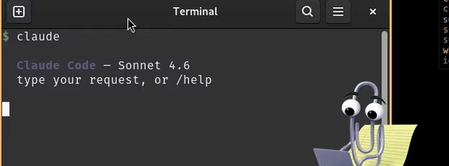

# Clippy

**A desktop mascot for Claude Code on Linux.** Clippy lives on your screen, reacts to your Claude Code session in real time, and dings you when Claude is done.

Native GTK + Rust. ~1 MB binary. No Electron, no Node, no webview.

<p align="center">
  
</p>

## Why

Claude Code runs in a terminal. You kick off a task and tab away. Five minutes later you come back — was it still working? Did it stop? Does it need input?

Clippy sits on top of your workspace, shows you at a glance, and plays a sound when Claude finishes or asks for you. That's it.

## How it works

1. Claude Code fires hooks on every session event (`UserPromptSubmit`, `PreToolUse`, `Stop`, `Notification`, …).
2. A small Python hook writes a per-session JSON state file under `~/.cache/clippy/sessions/`.
3. The Clippy window — a transparent, always-on-top GTK3 app — watches the directory and aggregates state across all running CC sessions.
4. Clippy walks the animation pack's state graph to pick the right transition and plays it.

States are `idle`, `working`, `alert` (CC prompted for attention), and `compacting` (context compaction). Priority: alert > working > compacting > idle.

## Install

```bash
git clone https://github.com/idajikuu/clippy-claude-code.git
cd clippy-claude-code
cargo build --release
./hooks/install.sh
```

That's it. The next Claude Code session auto-spawns Clippy via the hook.

### System requirements

- Linux with an X11 session and a compositor that supports per-pixel transparency (GNOME, KDE, anything with picom, etc.)
- Rust 1.70+
- GTK 3 dev headers (`libgtk-3-dev` / `gtk3-devel`)
- `paplay` for sound notifications (already installed on any PulseAudio / PipeWire system)

## Usage

- **Left-click + drag** — move Clippy around. Position is remembered across restarts.
- **Double-click** — open a new Claude Code terminal.
- **Right-click** — menu with always-on-top toggle, sound toggle, sound-file picker, and quit.

### Sound

Clippy plays a sound on two rising edges:

- `is_alert` false → true — Claude Code prompted for your attention.
- `is_working` true → false — Claude Code finished a response.

Sound file resolution order:

1. `CLIPPY_SOUND` environment variable
2. Path picked via **Choose sound…** in the right-click menu (stored in `~/.config/clippy/sound-path`)
3. `~/.config/clippy/ring.{oga,ogg,wav,mp3,flac}`
4. `/usr/share/sounds/freedesktop/stereo/complete.oga`

Drop any audio file at `~/.config/clippy/ring.oga` to set a default ring.

## Animation packs

The pack format is compatible with [Masko](https://masko.ai)'s state-graph JSON, so packs exported from Masko's gallery drop into `packs/` without conversion. The default pack is a Clippy character with four nodes (idle / working / needs-attention / thinking) and animated WebP transitions between them.

## Uninstall

```bash
./hooks/install.sh --uninstall
# optional: drop the binary and cached state
rm -rf target ~/.cache/clippy ~/.config/clippy
```

## License

MIT. See [`LICENSE`](LICENSE).

Clippy the character is property of Microsoft; this project is an unofficial fan tribute and is not affiliated with Microsoft or Anthropic.
